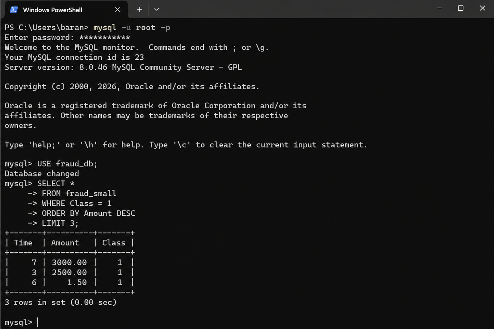

# 💳 Fraud Detection Analysis using SQL

## 📌 Project Overview
This project analyzes credit card transaction data to identify fraudulent patterns using SQL and basic data preprocessing techniques. The goal is to detect suspicious transactions and understand fraud behavior.

---

## 📸 SQL Output Example

Top 3 high-value fraud transactions identified using SQL:

---

## 📊 Key Insights
- Fraud transactions are very rare (imbalanced dataset)
- Small transactions are often used to test stolen cards
- High-value transactions show higher fraud risk
- SQL queries helped identify suspicious patterns effectively

---

## 🛠 Tools & Technologies
- MySQL
- SQL (Aggregation, CASE, Window Functions)
- Python (Pandas)

---

## 🔍 SQL Techniques Used
- GROUP BY & Aggregations
- CASE Statements
- Window Functions (RANK)
- Filtering & Sorting

---

## 🐍 Python Preprocessing
Used Python (Pandas) to:
- Load dataset
- Analyze fraud distribution
- Create a smaller dataset for SQL analysis

---

## ▶️ How to Run

1. Load dataset into MySQL
2. Run queries from `queries.sql`
3. View results using SELECT statements

---

## 🚀 Outcome
Developed a fraud detection analysis system using SQL to identify suspicious transaction patterns and generate meaningful insights for decision-making.

